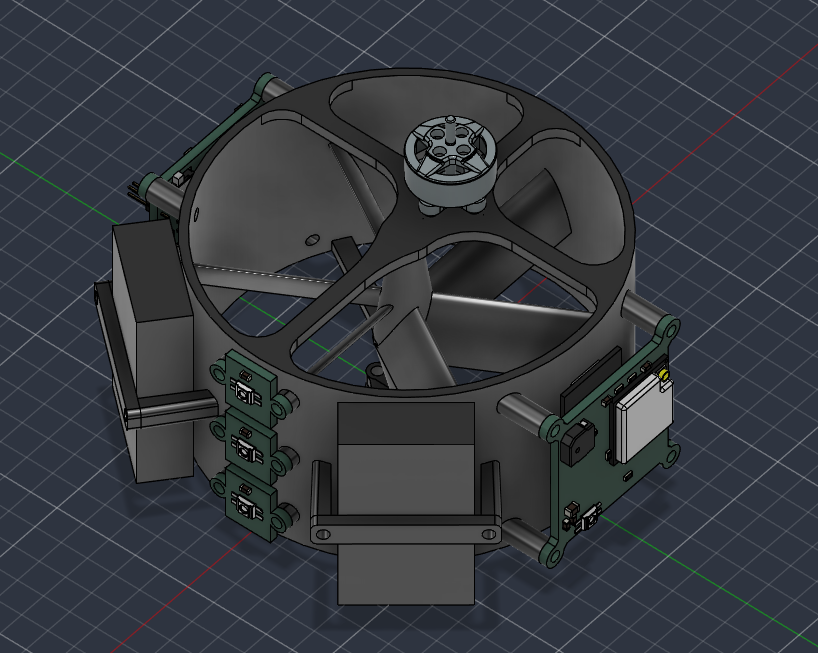
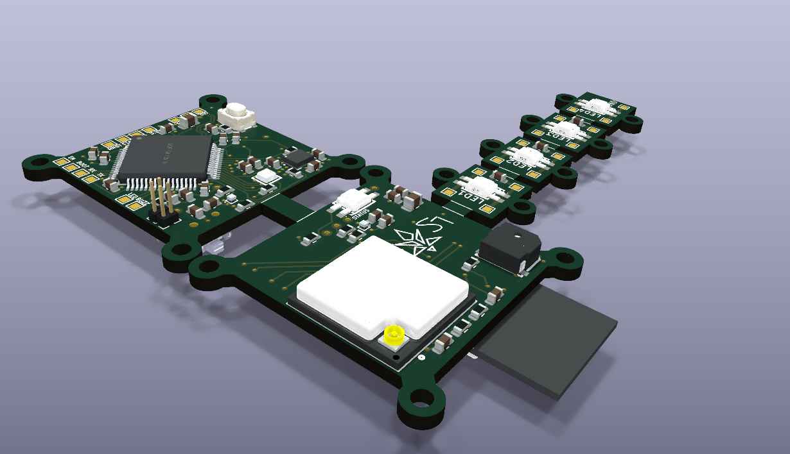
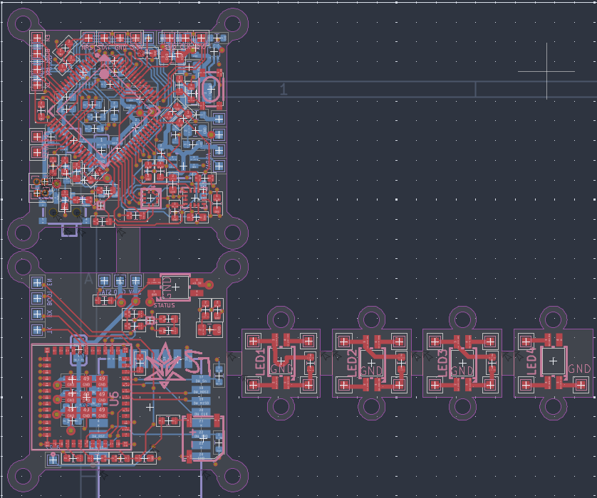
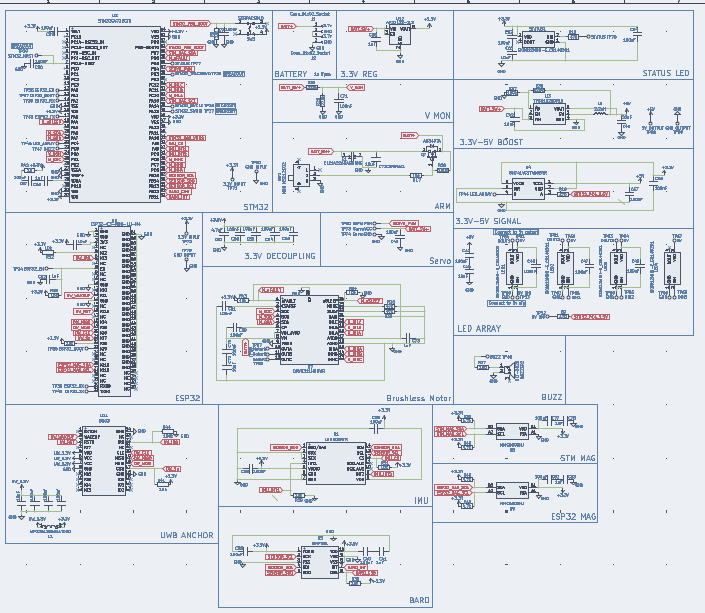

# LSwarm Firefly
A single motor Micro-Aerial Vehicle for drone swarm light displays

## Case

## 3D PCB Preview

## PCB Wiring

## PCB Schematic

### Download ./latestProduction to fabricate your own PCB.

## Introduction
The LS Firefly is the baby brother to the original [LS Mk.1](https://github.com/DerpyDoggo11/LSwarm), the goal is to be smaller, safer, and a little more unique than the previous drone. Although it does come at some costs such as reduced manuverability and no USB-C connectivity. Like the previous model, rather than using GPS, it uses UWB frequencies to communicate with ground anchors (see [LS Anchor](https://github.com/DerpyDoggo11/LSwarm-Anchor)) for positioning. To fabricate these drones yourself, see the bill of materials below and follow the instructions. 

Note: this drone is all open sourced under the GNU GPL license! (do what you will with the code and designs but make sure to keep it open-source! :D)

### Are drone swarms legal in the US?
TLDR: yes and no, mostly no but sometimes yes. 

In the US, flying more than one drone by yourself outside is technically not legal without a permit, but flying indoors (or under some netting outside) is perfectly allowed, so make sure you understand this before buying or assembling any components.

If you live outside of the US, the restrictions will be different so make sure you check with your local government. 

## Bill of Materials 

### (Minimum build for testing: 5 drones)

| Quantity | Components | Price | Link |
|--------- |----------|----------| -----|
| 5  | Brushless Motors | ~$56.27  | [here](https://www.aliexpress.us/item/3256811751884831.html?spm=a2g0o.productlist.main.5.4bc27ec1sXcpi9&algo_pvid=f93d3c7b-d188-41d3-8071-ca4f01f3da9e&algo_exp_id=f93d3c7b-d188-41d3-8071-ca4f01f3da9e-4&pdp_ext_f=%7B%22order%22%3A%2244%22%2C%22eval%22%3A%221%22%2C%22fromPage%22%3A%22search%22%7D&pdp_npi=6%40dis%21USD%2127.91%2112.75%21%21%2127.91%2112.75%21%402103129f17839010468456329ea712%2112000057077353974%21sea%21US%217493938711%21X%211%210%21n_tag%3A-29919%3Bd%3Ad260408f%3Bm03_new_user%3A-29895%3BpisId%3A5000000204411062&curPageLogUid=VGuc6eNMjhlE&utparam-url=scene%3Asearch%7Cquery_from%3A%7Cx_object_id%3A1005011938199583%7C_p_origin_prod%3A#nav-review)
| 5 | 65mm Propellers (1.5mm hole) | $2.42 | [here](https://www.aliexpress.us/item/3256808528649872.html?spm=a2g0o.productlist.main.1.b0be6fedKhbLdF&algo_pvid=3254f102-23a3-44f5-862f-50a3a50c42db&algo_exp_id=3254f102-23a3-44f5-862f-50a3a50c42db-0&pdp_ext_f=%7B%22order%22%3A%2263%22%2C%22eval%22%3A%221%22%2C%22fromPage%22%3A%22search%22%7D&pdp_npi=6%40dis%21USD%213.73%210.99%21%21%213.73%210.99%21%402101e80f17839019729517303e1028%2112000046361007970%21sea%21US%217493938711%21X%211%210%21n_tag%3A-29919%3Bd%3Ad260408f%3Bm03_new_user%3A-29895%3BpisId%3A5000000204411062&curPageLogUid=khfzd3PNDSbd&utparam-url=scene%3Asearch%7Cquery_from%3A%7Cx_object_id%3A1005008714964624%7C_p_origin_prod%3A) 
| 10  | 1s 300mAh Battery | ~$19.75 | [here](https://www.aliexpress.us/item/3256801127609470.html?spm=a2g0o.productlist.main.8.43a2a5M9a5M9yu&aem_p4p_detail=202607121047491621817576276750009408507&algo_pvid=07c6ddd0-7cad-4da9-88c7-c570960c9574&algo_exp_id=07c6ddd0-7cad-4da9-88c7-c570960c9574-7&pdp_ext_f=%7B%22order%22%3A%22137%22%2C%22eval%22%3A%221%22%2C%22fromPage%22%3A%22search%22%7D&pdp_npi=6%40dis%21USD%214.71%213.30%21%21%2131.79%2122.25%21%40210319b017838784692687812e95b8%2112000015664187048%21sea%21US%217493938711%21X%211%210%21n_tag%3A-29919%3Bd%3Ad260408f%3Bm03_new_user%3A-29895&curPageLogUid=hyAg3GWOKWbh&utparam-url=scene%3Asearch%7Cquery_from%3A%7Cx_object_id%3A1005001313924222%7C_p_origin_prod%3A&search_p4p_id=202607121047491621817576276750009408507_2) 
|5 | 2.4G Wifi Antennas | ~$3.52 | [here](https://www.aliexpress.us/item/3256802833801038.html?spm=a2g0o.productlist.main.17.44bbCrBdCrBdFl&algo_pvid=20d56933-2b0c-45d5-8601-1bc6a9682401&algo_exp_id=20d56933-2b0c-45d5-8601-1bc6a9682401-16&pdp_ext_f=%7B%22order%22%3A%221074%22%2C%22eval%22%3A%221%22%2C%22fromPage%22%3A%22search%22%7D&pdp_npi=6%40dis%21USD%213.55%213.52%21%21%213.55%213.52%21%402101ef5e17781321493642302e40a6%2112000023272348781%21sea%21US%217493938711%21X%211%210%21n_tag%3A-29913%3Bd%3A21b1ce8d%3Bm03_new_user%3A-29895&curPageLogUid=rLnZuf4b98Bi&utparam-url=scene%3Asearch%7Cquery_from%3A%7Cx_object_id%3A1005003020115790%7C_p_origin_prod%3A)
| 5  | LS Firefly PCBs | ~$25 (with shipping, cost can vary widely however) | Download repo, extract fabrication files, and fabricate pcb through JLCPCB, purchase components from LCSC (complete instructions for this may come soon)
| 5  | Electronics | ~$125 (with shipping, cost can vary widely however) | Purchase components from LCSC

Total cost: **$231,96**

Cost per drone: **$46.39**

## Tools / Other parts:
- Hot-air reflow station or SMD hot plate
- Soldering iron + solder
- Solder paste for SMD components
- Tweezers for SMD components

For drone light displays, you'll also need the [UWB anchors](https://github.com/DerpyDoggo11/LSwarm-Anchor) and a powerful MCU devboard or laptop.

## Assembly:
1. Apply solder paste to all smd components directly or through a stencil
2. Heat up components with a hot plate or hot-air gun
3. 3D print drone case
4. Mount components to drone case
4. Plug in USB-C port and upload software